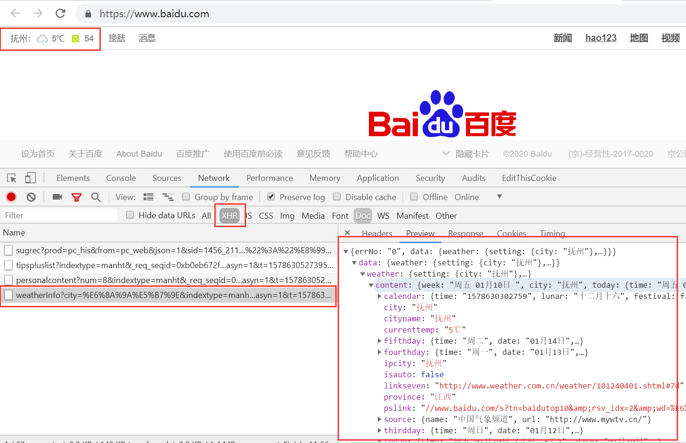

[TOC]

## <font color="#0099CC">requests作用</font>

模拟浏览器/APP发送请求

## <font color="#0099CC">requests与urllib</font>

- urllib模块是旧版本，使用起来复杂

- requests模块是新版本，简单便捷，功能强大

## <font color="#0099CC">requests数据抓取规范</font>

```
1.确定url

2.构造请求头、请求体

3.发起请求

4.获取响应数据
```

## <font color="#0099CC">第一个爬虫程序</font>

```python
'''
爬取百度首页
'''

# 导包
import requests

# step_1:指定url
url = 'https://www.baidu.com'

# step_2:发起请求:使用get方法发起get请求，该方法会返回一个响应对象。参数url表示请求对应的url
resp = requests.get(url=url)
resp.encoding = "utf-8"  # 指定编码

# step_3:获取响应数据:通过调用响应对象的text属性，返回响应对象中存储的字符串形式的响应数据（页面源码数据）
resp = resp.text

# step_4:持久化存储
with open('baidu.html', 'w', encoding='utf-8') as f:
    f.write(resp)
print('爬取数据完毕！！！')
```

解析：可以看到爬取结果基本接近原网页，但是还有部分数据没有下载，是因为有部分数据是JS动态加载，这种数据需要额外发送请求,下节会讲到。

如天气



